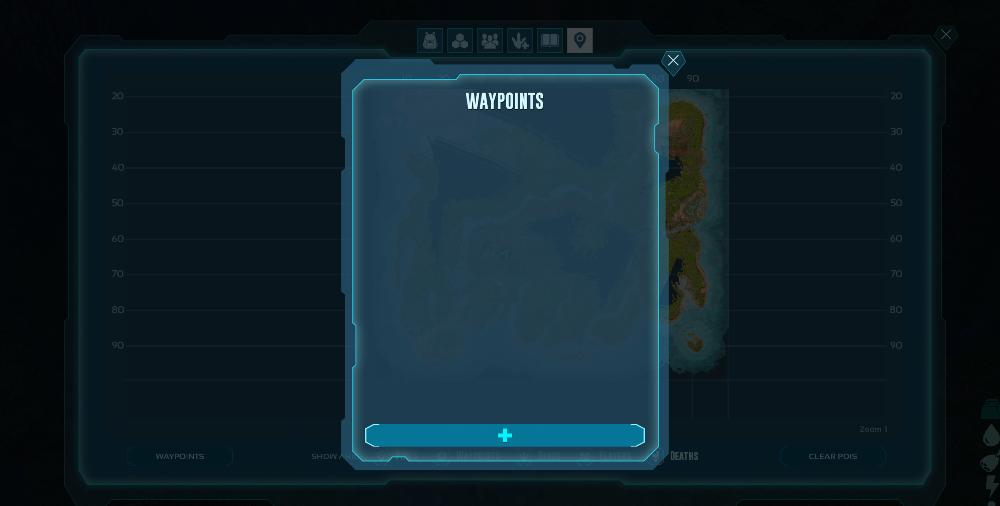
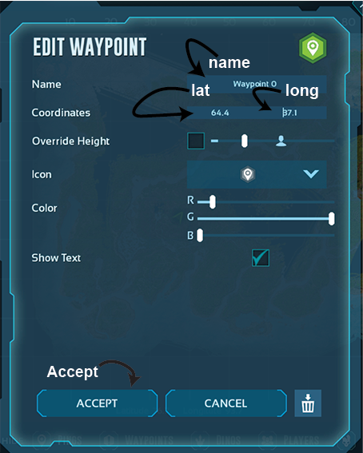

# Explorer Notes Auto Waypoint

This script will automatically add a waypoint to the map for each explorer notes in a note run.<br>
The `order.json` file is used to determine the route to take.<br>
The numbers in the file are the explorer note's ID as specified [on the wiki](https://ark.wiki.gg/wiki/Explorer_Map/The_Island?marker=dossier@44.890:64.411#ARK:_Survival_Ascended-0).<br>

## Installation

This script was made for [python 3.11](https://www.python.org/downloads/release/python-3116/) and should be installed to the path.<br>

Open up a command prompt in the folder where the script is located.<br>
To install the required packages, run the following command in the command prompt:
```bash
pip install -r requirements.txt
```

## Configuration
### Order
The `order.json` file is used to determine the order in which the explorer notes are collected.<br>
The numbers in the file are the explorer note's ID as specified [on the wiki](https://ark.wiki.gg/wiki/Explorer_Map/The_Island?marker=dossier@44.890:64.411#ARK:_Survival_Ascended-0).<br>
The order can be changed by editing the numbers in the file.<br>
Any order can be used, if you want to stray from the default or add more notes.<br>
A valid file is provided in the repository.<br>

### Button Co-ords
The `button-coords.json` file is used to determine the coordinates of the buttons.<br>
This is required so that the program knows where to click.<br>
This will need to be updated to match your display resolution.<br>
To do so run the autogui_show_coords.py script and follow the instructions below.<br>
The script running in the background will display the coordinates of the mouse cursor.<br>
Move the mouse cursor to the required location and note down the coordinates.<br>
For any text boxes, ensure that the cursor is in front of any text.<br>
Repeat this for each button.<br>
Once all the coordinates have been noted down, and the `button-coords.json` file has been updated close the script.<br>

The script should now be ready to use.

The button at the bottom of the image below is the new_waypoint button. 
The following image shows where each button is on the create waypoint page. 


## Usage
Ensure that the game is running in windowed mode and that the game is visible on the screen.<br>
See below to ensure that the game is in the correct position. <br>
This is the position required for the script to be able to create waypoints and can be accessed by clicking waypoints in your inventory map.<br>


To run the script, run the following command in the command prompt:
```bash
python explorer_notes.py
```
Provided that everything has been installed correctly, the script should display a message stating it will start in 10 seconds.<br>
The script will then create 16 waypoints on the map and display a message stating it has finished the batch.<br>
This box could be opened minimised so check your task bar.<br>
Once you have finished with the first batch of waypoints, delete them from your map put it back into a state where you can create waypoints and click ok on the alert box.<br>
Continue this process until all the waypoints have been created.<br>


### Note
The script will still work if the coordinates are not set correctly and will perform clicking actions.<br>
If you need to kill the script at any point move your mouse to the top corner of the screen.<br>

## License
[MIT](https://choosealicense.com/licenses/mit/)

## Contributing
Pull requests are welcome. For major changes, please open an issue first to discuss what you would like to change.
